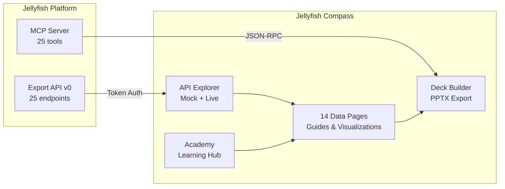
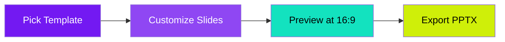
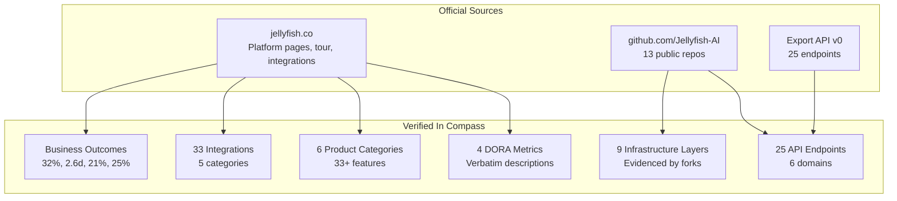
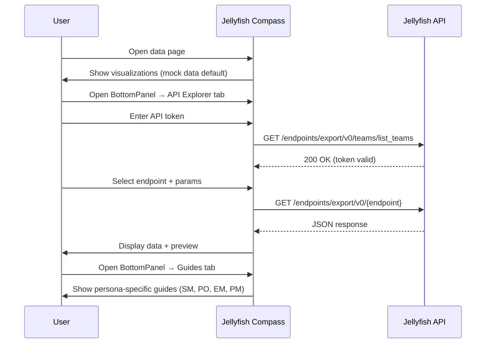

<div align="center">

# Jellyfish Compass

**A practical companion for Engineering Managers, Product Managers, Scrum Masters, and Product Owners using Jellyfish**

Understand platform metrics. Run guided workflows. Explore the API. Export presentation-ready decks.

[](https://jf.orizon.sh)
[](https://nextjs.org)
[](https://typescriptlang.org)
[](https://tailwindcss.com)
[](LICENSE)

</div>

---

## What is Jellyfish Compass?

Jellyfish Compass translates [Jellyfish](https://jellyfish.co) platform data into actionable insights for sprint ceremonies, stakeholder updates, and continuous improvement. It is not a replacement for the Jellyfish platform — it is a **learning and workflow companion** built around the [Jellyfish Export API v0](https://app.jellyfish.co/endpoints/export/v0/schema).



---

## Pages

14 pages organized into 4 categories, each with persona-specific guides (up to 4 personas: Scrum Master, Product Owner, Engineering Manager, Product Manager), mock data visualizations, and a collapsible API Explorer.

```
┌─────────────────────────────────────────────────────────────────────┐
│                        JELLYFISH COMPASS                            │
├──────────────────┬──────────────────┬────────────────┬──────────────┤
│ Metrics & Health │ Teams & Ops      │ Planning       │ Knowledge    │
│                  │                  │                │              │
│  Sprint Health   │  Allocation      │  Capacity      │  Deck Builder│
│  Delivery        │  People & Teams  │  Scenarios     │  Reference   │
│  DevEx           │  Workflow        │  AI Impact     │  Academy     │
│  Life Cycle      │  Benchmarks      │                │              │
└──────────────────┴──────────────────┴────────────────┴──────────────┘
```

### Metrics & Health

| Page | What it shows | Key endpoints |
|------|--------------|---------------|
| **Sprint Health** | Velocity, completion rate, carry-over trends | `team_sprint_summary`, `team_metrics` |
| **Delivery** | Scope, effort, deliverable status tracking | `work_category_contents`, `deliverable_details` |
| **DevEx** | Developer experience index, unlinked PRs | `devex_insights_by_team`, `unlinked_pull_requests` |
| **Life Cycle** | Issue-level cycle time, stage bottlenecks | `team_metrics`, `deliverable_details` |

### Teams & Operations

| Page | What it shows | Key endpoints |
|------|--------------|---------------|
| **Allocation** | FTE by investment category, team, person | `allocations_by_investment_category`, `allocations_by_team` |
| **People & Teams** | Roster, hierarchy, search | `list_engineers`, `list_teams`, `search_people` |
| **Workflow** | Intake-to-deployment handoff analysis | `work_category_contents` |
| **Benchmarks** | Cross-team metric comparison (for learning, not ranking) | `team_metrics`, `company_metrics` |

### Planning & Intelligence

| Page | What it shows | Key endpoints |
|------|--------------|---------------|
| **Capacity** | FTE forecasting, workload vs availability | `allocations_by_team`, `allocations_by_person` |
| **Scenarios** | What-if allocation modeling | `allocations_by_investment_category` |
| **AI Impact** | Tool adoption rates, before/after metrics | Platform-level (not Export API) |

### Knowledge

| Page | What it shows |
|------|--------------|
| **Deck Builder** | Visual PPTX builder with 9 templates, 13 slide blocks, Jellyfish-branded export |
| **Reference** | 16 subsections: 25 endpoints, MCP tools, DORA, integrations, infrastructure, and more |
| **Academy** | 4-tab learning hub: Modules, 17 Interactive Playbooks, Workspace, Showcase |

---

## PPTX Deck Builder

Build presentation-ready decks from Jellyfish metrics — no copy-pasting into slides.



**9 templates:** Sprint Review, Retro Prep, Stakeholder Update, Capacity Planning, QBR, For My Team, For Leadership, For Product, For Finance

**13 slide blocks:** Title, Sprint KPIs, Sprint History, Delivery Status, Scope & Effort, Allocation FTE, Team Allocation, DevEx Index, Unlinked PRs, Capacity Gaps, Benchmarks, DORA Metrics, Custom Text

**Brand themes:** Jellyfish Dark (navy `#0D062B` + purple `#7319F2`) and Jellyfish Light — sourced from [jellyfish.co](https://jellyfish.co)

---

## Data Sources

All factual content is sourced from official Jellyfish materials. No fabrications.



| Source | What we use |
|--------|-------------|
| [jellyfish.co/platform/devops-metrics](https://jellyfish.co/platform/devops-metrics/) | 4 DORA metric definitions (verbatim) |
| [jellyfish.co/platform/devex](https://jellyfish.co/platform/devex/) | DevEx features, Kaleris outcomes (21% productive, 19% efficient) |
| [jellyfish.co/platform/resource-allocations](https://jellyfish.co/platform/resource-allocations/) | Patented Work Model description |
| [jellyfish.co/tour](https://jellyfish.co/tour/) | Business outcome stats |
| [jellyfish.co/platform/integrations](https://jellyfish.co/platform/integrations/) | Integration catalog |
| [github.com/Jellyfish-AI/jellyfish-mcp](https://github.com/Jellyfish-AI/jellyfish-mcp) | 25 MCP tools, config variables |
| [github.com/Jellyfish-AI/jf_agent](https://github.com/Jellyfish-AI/jf_agent) | Run modes, env vars, git providers |
| [github.com/Jellyfish-AI/jellyfish-buildkite-plugin](https://github.com/Jellyfish-AI/jellyfish-buildkite-plugin) | Webhook payload schema |

---

## API Integration



**Three modes:**

| Mode | Auth | Data Source |
|------|------|-----------|
| **Mock** (default) | None | Built-in sample data |
| **API** | `Authorization: Token <token>` | Live Jellyfish Export API |
| **MCP** | MCP server URL | Running [jellyfish-mcp](https://github.com/Jellyfish-AI/jellyfish-mcp) instance |

Tokens generated at [app.jellyfish.co/settings/data-connections/api-export](https://app.jellyfish.co/settings/data-connections/api-export) (requires Admin User Role). Token is stored in client-side state only — never persisted or sent anywhere except Jellyfish.

---

## Tech Stack

| Layer | Technology |
|-------|-----------|
| Framework | [Next.js 15](https://nextjs.org) (App Router, static export) |
| UI | [React 19](https://react.dev), [Tailwind CSS v4](https://tailwindcss.com), [shadcn/ui](https://ui.shadcn.com) |
| Icons | [Lucide React](https://lucide.dev) |
| PPTX | [pptxgenjs](https://github.com/gitbrent/PptxGenJS) (client-side generation) |
| Drag & Drop | [@dnd-kit](https://dndkit.com) |
| Theming | [next-themes](https://github.com/pacocoursey/next-themes) |
| Hosting | [Vercel](https://vercel.com) |
| Language | TypeScript 5.8 (strict mode) |

---

## Getting Started

```bash
# Clone
git clone https://github.com/diegocconsolini/JellyFish-Compass.git
cd JellyFish-Compass

# Install
npm install

# Run locally
npm run dev
```

Open [http://localhost:3000](http://localhost:3000).

```bash
# Production build
npm run build && npm start

# Type check + lint
npm run typecheck && npm run lint
```

---

## Project Structure

```
app/
  page.tsx                    Landing page
  layout.tsx                  Root layout (theme provider, skip nav)
  sprint-health/              Sprint velocity, completion, carry-over
  delivery/                   Scope, effort, deliverable tracking
  allocation/                 FTE by investment, team, person
  devex/                      Developer experience, unlinked PRs
  people-teams/               Roster, hierarchy, search
  life-cycle/                 Issue-level cycle time, bottlenecks
  workflow/                   Intake-to-deployment handoff analysis
  benchmarks/                 Cross-team metric comparison
  capacity/                   FTE forecasting, workload planning
  ai-impact/                  AI tool adoption, ROI measurement
  scenarios/                  What-if allocation modeling
  metrics/                    PPTX Deck Builder
  reference/                  API reference (16 subsections)
  academy/                    Learning hub (4 tabs)
    playbooks/[slug]/         Dynamic interactive playbook detail pages
components/
  layout/                     Header (responsive hamburger), footer
  ui/                         StatCard, DataTable, ProgressBar, Badge, BottomPanel, GuidePanel, ApiDrawer, SectionDivider, PlaybookCard, PlaybookProgress, PlaybookStepSection, etc.
  metrics/                    Deck Builder components
data/
  endpoints-full.ts           25 API endpoints across 6 domains
  mock-data.ts                Mock data for all visualization pages
  dora-metrics.ts             4 DORA metrics (verbatim)
  integrations.ts             33 tools across 5 categories
  playbooks.ts                17 interactive playbook definitions
  slide-templates.ts          13 slide blocks, 9 deck templates
lib/
  api-client.ts               Jellyfish API client
  export-pptx.ts              PPTX slide generation engine
  export-pptx-themes.ts       Jellyfish dark/light brand themes
```

---

## Data Page Layout

Every data page follows a consistent layout pattern with progressive disclosure:

```
PageHero (eyebrow + title + subtitle)
───────────────────────────────── gradient divider
Stat Cards (if applicable)
───────────────────────────────── gradient divider
Primary visualization (table + chart side by side)
─ ─ ─ ─ ─ ─ ─ ─ ─ ─ ─ ─ ─ ─ ─ thin rule
Secondary visualization (if applicable)
───────────────────────────────── gradient divider
BottomPanel [Guides tab open by default]
  ├─ Guides tab → GuidePanel with persona sub-tabs
  └─ API Explorer tab → Token input + endpoint explorer
```

The **BottomPanel** keeps guide content and API tools out of the way for casual users while remaining one click away for power users. The **GuidePanel** inside supports up to 4 persona tabs (pills on desktop, dropdown on mobile):

| Persona | Focus | Pages |
|---------|-------|-------|
| **Scrum Master** | Sprint ceremonies, tactical process health | All 11 |
| **Product Owner** | Backlog priorities, delivery confidence | 10 of 11 |
| **Engineering Manager** | Team coaching, capacity planning, burnout prevention | All 11 |
| **Product Manager** | Investment allocation, roadmap feasibility, leadership communication | 9 of 11 |

All guide content is grounded in official Jellyfish materials (jellyfish.co, case studies, solution pages) with source citations. No fabricated thresholds or benchmarks.

---

## Interactive Playbooks

17 guided workflows organized as a category journey timeline, each with inline visualizations, embedded API Explorer, and persona-specific guidance.

| Category | Playbooks | Source |
|----------|-----------|--------|
| **Sprint & Delivery** | Sprint Retrospective, Delivery Health Check, Issue Cycle Time Analysis, Delivery Timeline Management | jellyfish.co/blog |
| **Capacity & Planning** | Capacity & Allocation Review, Capacity Planning for Quarterly Roadmap, Resource Allocation Audit | jellyfish.co/blog |
| **DevEx & Health** | DevEx Survey & Action Planning, Team Health Assessment, Burnout Detection & Prevention | jellyfish.co/blog |
| **Metrics** | DORA Metrics Implementation, Engineering Metrics Strategy, Developer Productivity Measurement | jellyfish.co/blog |
| **Executive** | Stakeholder Status Summary, Board Presentation Prep | jellyfish.co/blog |
| **AI & Innovation** | AI Impact Measurement, Technical Debt Prioritization | jellyfish.co/blog |

Each playbook features:
- **Sticky progress bar** tracking current step via IntersectionObserver
- **Inline visualizations** (StatCards, BarCharts, DataTables, ProgressBars) with mock data
- **Per-step API Explorer** pre-loaded with relevant endpoints
- **Persona guides** at the top (SM, PO, EM, PM — varies by playbook)
- **Source citation** linking to the official Jellyfish blog/resource page

All playbook content is grounded in official Jellyfish materials — no fabricated data.

---

## Accessibility

Built to **WCAG 2.1 AA** standards:

- ARIA tab patterns on navigation and Academy tabs
- `role="progressbar"` with `aria-valuenow/min/max` on all progress bars
- Screen reader text on bar charts (`figcaption`)
- Skip navigation link + `:focus-visible` outlines
- `prefers-reduced-motion` respected
- Minimum 12px text, 44px touch targets on mobile
- Non-color status indicators (★ best-in-class, ⚠ warnings)
- Responsive: hamburger menu on mobile, collapsible grids

---

## Limitations

1. Jellyfish API documentation is behind authentication
2. Help Center (help.jellyfish.co) requires login
3. Integration provenance varies — some from integrations page, others from homepage
4. DORA descriptions are verbatim from jellyfish.co — exactly 4 metrics
5. Mock data is fictional and clearly labeled

---

## License

MIT

---

<div align="center">

All data sourced from official [Jellyfish](https://jellyfish.co) documentation and [Jellyfish-AI](https://github.com/Jellyfish-AI) public repositories.

**Contact:** [diego@orizon.sh](mailto:diego@orizon.sh)

</div>
